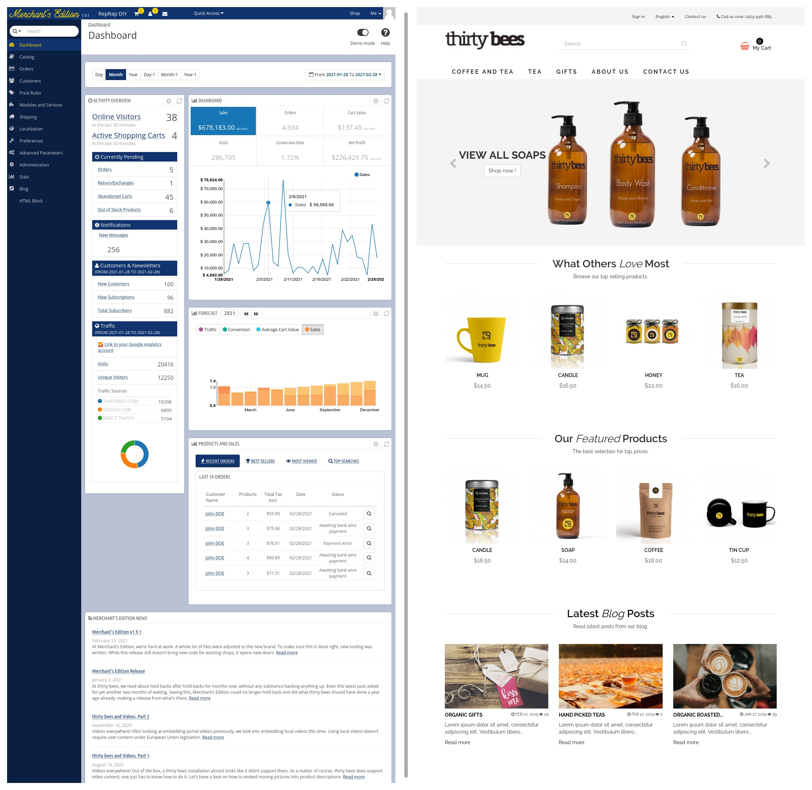

# Merchant’s Edition

PrestaShop 1.6 created a great framework, thirty bees made it stable, **Merchant’s Edition** makes this solution with its rich featureset easily accessible for non-technical merchants.

**Merchant’s Edition** is a matured e-commerce solution which is still compatible with (almost) all PS 1.6 modules and themes. Its focus is on stability, correctness and reliability of the rich feature set, to allow merchants to focus on growing their business.




## Distinctive Advantage

What distinguishes **Merchant's Edition** from PrestaShop and other derivatives thereof?

- **Merchant's Edition** aims at being easier to use. There are dozens of options which can be figured automatically rather than in need of manual configuration. Merchants are experts in trading, not software.
- **Merchant's Edition** aims at being lightweight and faster. Good performance is key for success of a shop. Some successes already, lots of ideas in this queue.
- **Merchant's Edition** aims to think more out of the box. Like providing intuitive GDPR handling. Like collaboration with content management systems. Like collaboration with warehouse management and EPR. There's quite some room for improvement in this area.
- **Merchant's Edition** is for merchants taking their business seriously, only.

Where does **Merchant's Edition** not distinguish?

- Compatibility with almost all PrestaShop 1.6 themes and modules.


## Development Strategy

**Merchant’s Edition** is commited to being free and open source. This is considered to be key for success.

**Merchant’s Edition** is pretty matured already, this allows to advance in small, rapid steps.

**Merchant’s Edition** accepts contributions in form of patches, pull requests, by email, via the bug tracker, whatever is convenient for you.

**Merchant’s Edition** schedules for about a monthly release. Goal for each release is [**Zero Known Bugs**](https://github.com/merchantsedition/merchantsedition/issues?q=is%3Aissue+is%3Aopen+label%3ABug).


## Roadmap

These are the plans for the next release:

### 1. Installer

- Re-brand for Merchant's Edition, of course.
- Remove clutter, like duplicate links and social network icons.
- Create the database automatically if not existing.

### 2. Logos & Favicons

These are not only still tb ones. They're also a bit messy. [Favicon Generator](https://realfavicongenerator.net/) has some nice ideas on how to get this right.

### 3. Your Most Missing Feature

Eagerly waiting for some feature or bug fix? **Merchant’s Edition** happily
accepts your sponsoring to get this done. Other merchants do this already,
watch out for _... sponsored by ..._ notes in the commit message.

### 4. Performance improvements

A number of steps on these long lasting tasks:
- Remove really old code. Like retrocompatibility code for PS 1.4 and older.
- Remove pointless configuration switches in back office. Quite a number of them are outdated or useless, just distracting merchants and slowing down operations.
- Support for multiple encryption algorithms. One reliable encryption is entirely sufficient.
- ...


## Requirements

Support for these general requirements (except recommendations) gets tested during installation, so one can simply try to proceed. A proceeding installation means all requirements are met.

- PHP 5.6 - PHP 7.4 with a minimum of 128 MiB RAM
- Apache or nginx
- Linux or MacOS
- MySQL 5.5.3+ or MariaDB 5.5+
- PHP extensions:
  - Required:
    - bcmath
    - gd
    - json
    - mbstring
    - openssl
    - mysql (PDO only)
    - xml (SimpleXML, DOMDocument)
    - zip
  - Recommended:
    - imap (for allowing to use an IMAP server rather than PHP's built-in mail function)
    - curl (for better handling of background HTTPS requests)
    - opcache (not mandatory because some hosters turn this off in favor of other caching mechanisms)
    - apcu/redis/memcache(d) (for the (currently incomplete) full page cache)


## Installation for Shop Owners

- Download the [latest release package](https://github.com/merchantsedition/merchantsedition/releases) (_merchantsedition-vXXX.zip_, ~43 MiB).
- Unpack this ZIP file into your web hosting directory. If you have no shell access, unpack it locally and upload all files, e.g. with [FileZilla](https://filezilla-project.org/). Installing into a subdirectory works fine.
- Direct your browser to your webhosting, it should show the installer.
- Follow instructions.


## Installation for Developers

- Recursively clone the repository and choose tag release version number from the -b parameter:
```shell
$ git clone https://github.com/merchantsedition/merchantsedition.git --recurse-submodules
```
- Then cd into the `merchantsedition` folder
- Run composer to install the dependencies:
```shell
$ composer install
```
- Then install the software as usual, using a web browser (typically http://localhost/install-dev).


## Installation via Command Line

With the distribution package unpacked or the Git repository cloned, one can also install on the command line, no manual interaction required:
```shell
$  php install-dev/index_cli.php --newsletter=1 --language=en --country=us --domain=merchants.edition:8888 --db_name=merchantsedition --db_create=1 --name=merchantsedition --email=test@merchants.edition --firstname=merchants --lastname=edition --password=merchantsedition
```
- Arguments available:
```
--step          all / database,fixtures,theme,modules                   (Default: all)
--language      Language iso code                                       (Default: en)
--all_languages Install all available languages                         (Default: 0)
--timezone                                                              (Default: Europe/Paris)
--base_uri                                                              (Default: /)
--domain                                                                (Default: localhost)
--db_server                                                             (Default: localhost)
--db_user                                                               (Default: root)
--db_password                                                           (Default: )
--db_name                                                               (Default: thirtybees)
--db_clear      Drop existing tables                                    (Default: 1)
--db_create     Create the database if not exist                        (Default: 0)
--prefix                                                                (Default: tb_)
--engine        InnoDB                                                  (Default: InnoDB)
--name                                                                  (Default: thirty bees)
--activity                                                              (Default: 0)
--country                                                               (Default: fr)
--firstname                                                             (Default: John)
--lastname                                                              (Default: Doe)
--password                                                              (Default: 0123456789)
--email                                                                 (Default: pub@thirtybees.com)
--license       Show Merchant's Edition license                         (Default: 0)
--newsletter    Get news from Merchant's Edition                        (Default: 1)
--send_email    Send an email to the administrator after installation   (Default: 1)
```


## Contributing

See [CONTRIBUTING.md](CONTRIBUTING.md)
